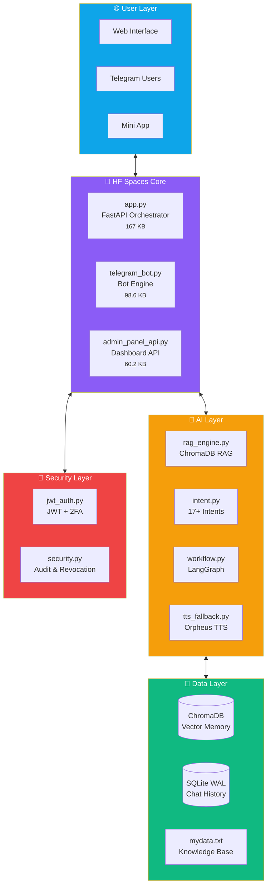

<div align="center">

#  Avinash Digital Twin Ecosystem

### *"If I have to do it twice, I script it."*

[](https://huggingface.co/spaces/AvinashAnalytics/avinash-chatbot/tree/main)
[](https://avinashanalytics-avinash-chatbot.hf.space)
[](https://t.me/AvinashAnalytics_bot)
[](https://groq.com/)

<br/>


---

**🧠 A self-aware AI agent that represents my professional identity 24/7**

*RAG-Powered • Voice-Enabled • Admin-Controlled • Always Learning*

<br/>

[🎮 Try Demo](https://avinashanalytics-avinash-chatbot.hf.space) · [📦 Browse Code](https://huggingface.co/spaces/AvinashAnalytics/avinash-chatbot/tree/main) · [🎛️ Admin Panel](https://avinashanalytics-avinash-chatbot.hf.space/mini_app/user) · [📖 Security Docs](https://huggingface.co/spaces/AvinashAnalytics/avinash-chatbot/blob/main/SECURITY.md)

</div>

---

## 📍 Source Code Location

> **🤗 Complete source code hosted on Hugging Face Spaces:**
> 
> ### 👉 [huggingface.co/spaces/AvinashAnalytics/avinash-chatbot](https://huggingface.co/spaces/AvinashAnalytics/avinash-chatbot)
>
> Click the **"Files"** tab to browse all code, or clone using instructions below.

---

## ⚠️ Disclaimer

> **This is NOT a job assignment. This is NOT a tutorial.**
> 
> This is pure *"Vibe Coding"* — hundreds of hours building an AI ecosystem driven by obsession with LLMs, voice synthesis, and automation. Every commit at 2 AM, fueled by curiosity and mass amounts of ☕

---

## 🏗️ System Architecture



---

## ⚡ Core Features

<table>
<tr>
<td width="50%" valign="top">

### 🧠 Hybrid RAG Memory
**Dual-tier contextual memory:**

| Component | Technology |
|:---|:---|
| Semantic Search | ChromaDB + MiniLM-L6-v2 |
| Chat History | SQLite (WAL Mode) |
| Knowledge Base | `mydata.txt` (18.9 KB) |

</td>
<td width="50%" valign="top">

### 🗣️ Orpheus Voice Engine
**Real-time TTS with fallback chain:**

```
Primary:   Orpheus TTS (v4.0)
Fallback:  Groq TTS
Fallback:  Edge-TTS
```
*See: `tts_fallback.py` & `TTS_FALLBACK_README.md`*

</td>
</tr>
<tr>
<td width="50%" valign="top">

### 🔐 Enterprise Security
**JWT + 2FA authentication system:**

- 🔑 JWT token authentication
- 📱 2FA with backup codes
- 🚫 Token revocation
- 📋 Full audit logging

*See: `SECURITY.md` for details*

</td>
<td width="50%" valign="top">

### 🤖 Bot Builder
**Visual Telegram bot customization:**

- 📝 Start message editor
- 🔘 Button management
- ⚙️ Dynamic configuration
- 🎨 No-code interface

*See: `button_builder.py`*

</td>
</tr>
</table>

---

## 📁 Complete File Structure

```
avinash-chatbot/                    # 730 KB Total
│
├── 🚀 CORE APPLICATION
│   ├── app.py                      # 167 KB - FastAPI main orchestrator
│   ├── telegram_bot.py             # 98.6 KB - Telegram bot engine
│   ├── admin_panel_api.py          # 60.2 KB - Admin dashboard API
│   └── workflow.py                 # 10.1 KB - LangGraph workflows
│
├── 🧠 AI & INTELLIGENCE
│   ├── rag_engine.py               # 7.77 KB - ChromaDB RAG system
│   ├── intent.py                   # 23.2 KB - Intent classification (17+)
│   ├── memory_engine.py            # 6.5 KB - Memory management
│   ├── model_factory.py            # 3.13 KB - Model initialization
│   └── mydata.txt                  # 18.9 KB - Knowledge base
│
├── 🗣️ VOICE ENGINE
│   ├── tts_fallback.py             # 13.1 KB - Orpheus TTS + fallbacks
│   └── TTS_FALLBACK_README.md      # 7.24 KB - TTS documentation
│
├── 🔐 SECURITY
│   ├── security.py                 # 16.2 KB - Auth & audit system
│   ├── jwt_auth.py                 # 17.9 KB - JWT + 2FA
│   └── SECURITY.md                 # 5.83 KB - Security documentation
│
├── 🎛️ ADMIN TOOLS
│   ├── admin_engine.py             # 13.9 KB - Admin functions
│   ├── admin_replies.py            # 3.91 KB - Manual reply queue
│   ├── button_builder.py           # 11.1 KB - Bot button builder
│   └── logger.py                   # 30.2 KB - Logging system
│
├── 🐳 DEPLOYMENT
│   ├── Dockerfile                  # 2.26 KB - HF Spaces container
│   ├── requirements.txt            # 382 B - Python dependencies
│   ├── .env.example                # 2.82 KB - Environment template
│   └── DEPLOY_EVERYTHING.ps1       # 1.62 KB - Deploy script
│
├── 📁 DIRECTORIES
│   ├── static/                     # Frontend assets (HTML, CSS, JS)
│   ├── project-showcase/           # Showcase page
│   ├── scripts_archive/            # Utility scripts
│   └── tests/                      # Test files
│
└── 📄 OTHER
    ├── README.md                   # This file
    ├── .gitignore
    └── .dockerignore
```

---

## 🛠️ Tech Stack

<div align="center">

| Layer | Technology | File |
|:---:|:---|:---|
| **🧠 LLM** | Llama 3 70B via Groq | `model_factory.py` |
| **💾 Vector DB** | ChromaDB + MiniLM-L6-v2 | `rag_engine.py` |
| **🗄️ Database** | SQLite (WAL Mode) | `logger.py` |
| **⚙️ Backend** | FastAPI + Uvicorn | `app.py` |
| **🔐 Auth** | JWT + TOTP 2FA | `jwt_auth.py`, `security.py` |
| **🗣️ Voice** | Orpheus + Edge-TTS | `tts_fallback.py` |
| **📱 Bot** | python-telegram-bot | `telegram_bot.py` |
| **🐳 Deploy** | Docker on HF Spaces | `Dockerfile` |

</div>

---

## 🚀 Quick Start

### Option 1: Clone with Git-Xet (Recommended)

```bash
# Install git-xet
brew install git-xet      # macOS
git xet install

# Clone repository
git clone https://huggingface.co/spaces/AvinashAnalytics/avinash-chatbot
cd avinash-chatbot
```

### Option 2: HuggingFace CLI

```powershell
# Install HF CLI (Windows)
powershell -ExecutionPolicy ByPass -c "irm https://hf.co/cli/install.ps1 | iex"

# Download Space
hf download AvinashAnalytics/avinash-chatbot --repo-type=space
```

### Option 3: Clone without large files

```bash
GIT_LFS_SKIP_SMUDGE=1 git clone https://huggingface.co/spaces/AvinashAnalytics/avinash-chatbot
```

---

## ⚙️ Environment Setup

Copy `.env.example` to `.env` and configure:

```bash
# ═══════════════════════════════════════════════════════════════
# TELEGRAM CONFIGURATION
# ═══════════════════════════════════════════════════════════════
TELEGRAM_BOT_TOKEN=your_bot_token_from_botfather
ADMIN_TELEGRAM_CHAT_ID=your_telegram_user_id

# ═══════════════════════════════════════════════════════════════
# SECURITY (Required for Admin Panel)
# ═══════════════════════════════════════════════════════════════
ADMIN_API_KEY=generate_with_secrets.token_urlsafe(32)
WEBHOOK_SECRET=generate_with_secrets.token_hex(32)

# ═══════════════════════════════════════════════════════════════
# DEPLOYMENT
# ═══════════════════════════════════════════════════════════════
PORT=7860
```

**Generate secure keys:**
```python
import secrets
print("ADMIN_API_KEY:", secrets.token_urlsafe(32))
print("WEBHOOK_SECRET:", secrets.token_hex(32))
```

---

## 🐳 Run with Docker

```bash
# Build
docker build -t avinash-twin .

# Run
docker run -p 7860:7860 \
  -e TELEGRAM_BOT_TOKEN="your_token" \
  -e ADMIN_TELEGRAM_CHAT_ID="your_id" \
  -e ADMIN_API_KEY="your_key" \
  avinash-twin
```

---

## 📊 System Metrics

<div align="center">

```
╔════════════════════════════════════════════════════════════════════╗
║                    🟢 SYSTEM STATUS: OPERATIONAL                   ║
╠════════════════════════════════════════════════════════════════════╣
║  Component              │  Status      │  Version / Details        ║
╠════════════════════════════════════════════════════════════════════╣
║  🧠 LLM Engine          │  ✅ Online   │  Llama 3 70B @ Groq       ║
║  💾 Vector Memory       │  ✅ Active   │  ChromaDB + MiniLM        ║
║  🗣️ Voice Engine        │  ✅ Ready    │  Orpheus TTS (v4.0)       ║
║  🔐 Auth System         │  ✅ Secure   │  JWT + 2FA + Revocation   ║
║  📱 Telegram Bot        │  ✅ Running  │  Admin Bridge Active      ║
║  🎛️ Admin Panel         │  ✅ Live     │  Full Dashboard           ║
║  🤖 Bot Builder         │  ✅ Active   │  Visual Config UI         ║
╚════════════════════════════════════════════════════════════════════╝
```

</div>

---

## 📖 Documentation

| Document | Description |
|:---|:---|
| [SECURITY.md](https://huggingface.co/spaces/AvinashAnalytics/avinash-chatbot/blob/main/SECURITY.md) | Authentication, 2FA, audit logs |
| [TTS_FALLBACK_README.md](https://huggingface.co/spaces/AvinashAnalytics/avinash-chatbot/blob/main/TTS_FALLBACK_README.md) | Voice engine configuration |
| [.env.example](https://huggingface.co/spaces/AvinashAnalytics/avinash-chatbot/blob/main/.env.example) | Environment variables template |

---

## 🔗 Connect

<div align="center">

[](https://avinashanalytics.github.io/)
[](https://linkedin.com/in/AvinashAnalytics)
[](https://t.me/AvinashAnalytics_bot)
[](https://huggingface.co/AvinashAnalytics)

---

**Built with ❤️ and mass amounts of ☕ by [Avinash Rai](https://avinashanalytics.github.io)**

<sub>© 2024 Avinash Rai • All Digital Rights Reserved</sub>

<br/>


</div>
```

